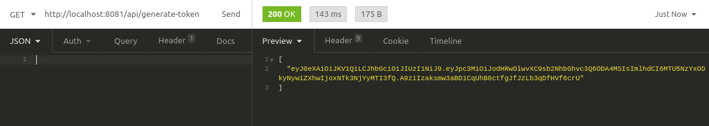
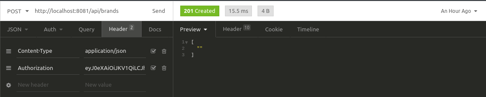
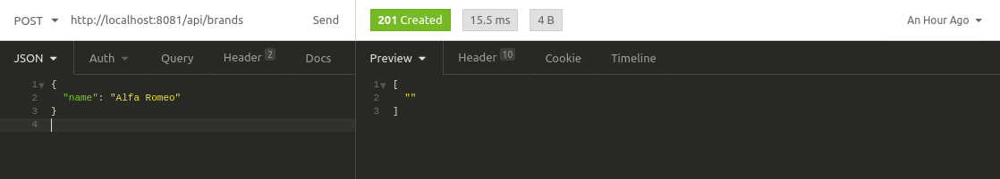
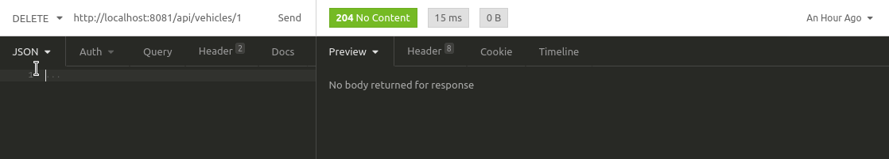

# backend

## Installation

#### Requirements
* [Docker](https://www.docker.com/)

#### Run
```
docker-compose up
```
***The code above will create a container with php, composer and mysql.
It will create database and download all dependencies.
The container will run in port 8081***

#### Tests
First, enter in container, check the container name with command:
```
docker ps
```
Enter in container, in my case the container name is vehiclebackend_site_1:
```
docker exec -it vehiclebackend_site_1 bash
```
Second, go to project folder:
```
cd /var/www/html
```
Third, run the code below to run all tests:
```
vendor/bin/phpunit --configuration /var/www/html/phpunit.xml
```

#### Tools
* PHP 7.4
* Composer
* PlugRoute v3.9
* PHPUnit 7.5.20
* PDO

#### Project Structure
I built this structure based on the clean architecture standard.
* /src <- My Application, Domain and Infrastructure layer
    * /Application <- My controllers, middlewares, bounderies, exceptions and presenters.
    * /Domain <- My domain classes.
    * /Infrastructure <- My database, repositories and validators.
* /dump <- Database structure.
* /tests <- My tests.
* /routes <- My routes.
* /public <- The place where all requests are redirected.

### API

***Reminder that this project run in port 8081.***

#### Token
> To test api in admin mode, firstly access the route /api/generate-token to get token.


> Put the token in header Authorization and then do a request. 


#### Brands
> POST /api/brands
```json
{
  "name": "Alfa Romeo"
}
```

> PUT /api/brands/{id}

```json
{
  "name": "Ford"
}
```
> DELETE /api/brands/{id}

> GET /api/brands/{id}

> GET /api/brands <- This request must be done without Authorization header.

#### Models
> POST /api/models
```json
{
  "name": "AMAROK CS2.0 16V/S2.0 16V TDI 4x2 Diesel",
  "brandId": 3
}
```
> PUT /api/models/{id}
```json
{
  "name": "AMAROK CS2.0 16V/S2.0 16V TDI 4x2 Diesel",
  "brandId": 3
}
```
> DELETE /api/models/{id}

> GET /api/models/{id}

> GET /api/models/{brandId}  <- This request must be done without Authorization header.

#### Vehicles
> POST /api/vehicles
```json
{
	"value": 11532.00,
	"brandId": 2,
	"modelId": 2,
	"yearModel": 2000,
	"fuel": "Flex"
}
```
> PUT /api/vehicles/{id}
```json
{
	"value": 11532.00,
	"brandId": 2,
	"modelId": 2,
	"yearModel": 2000,
	"fuel": "Flex"
}
```

> DELETE /api/vehicles


> GET /api/vehicles/{id}

> GET /api/vehicles/{modelId} <- This request must be done without Authorization header.